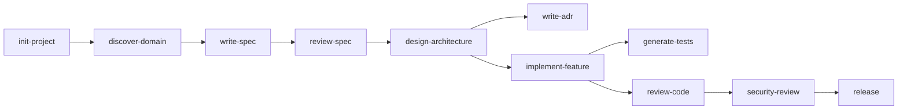
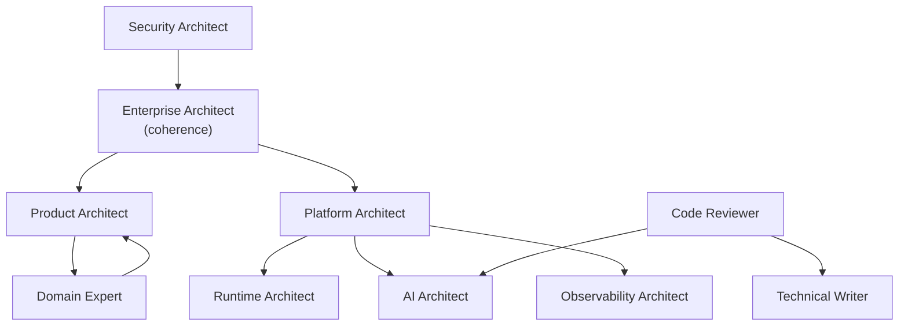
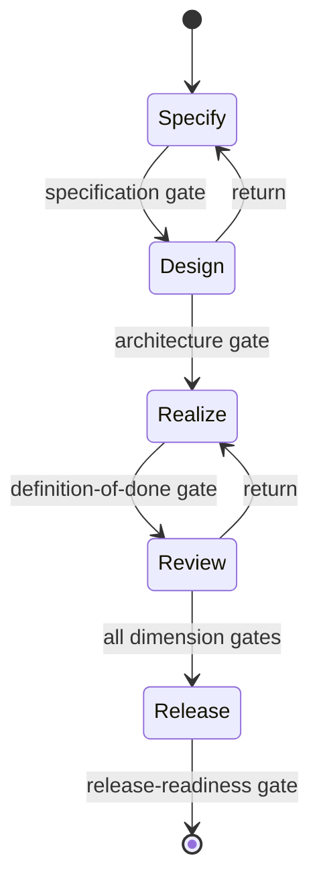
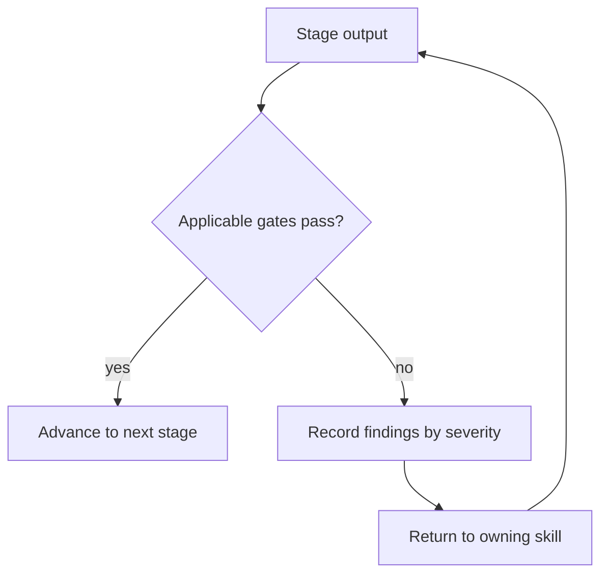
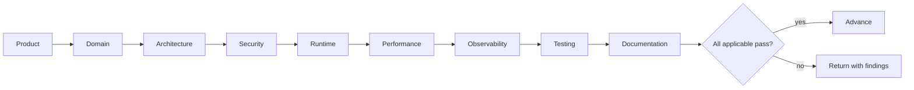

# Execution Architecture

How the parts of the APEF Execution Framework relate, shown conceptually. These diagrams
explain the framework's structure and process; they are not implementation and contain no
technology. They are consistent with the [Execution Framework](EXECUTION_FRAMEWORK.md) and the
Handbook it operationalizes.

## The model in one sentence

A **workflow** advances through stages; each stage runs a **command** executed by **skills**
under a **prompt contract**; the command's output is admitted only when the applicable
**reviews** pass their **quality gates** — and every part traces to the Handbook chapter that
owns its concern.

## 1. Command orchestration

The commands as they typically sequence, from establishing an effort to release. Not every
command runs in every workflow; workflows select and order them.

## 2. Skill collaboration

The specialist skills and who defers to whom. The Enterprise Architect holds
whole-of-platform coherence; the Security Architect is consulted across all; the Code Reviewer
hands AI-quality concerns to the AI Architect.

## 3. Workflow lifecycle

The stages a workflow passes through, each gated; a failed gate returns the work to the
previous stage.

## 4. Decision flow

The gate decision applied at the end of every stage.

## 5. Review pipeline

The nine review dimensions in order; the artifact advances only when all applicable
dimensions pass.

## Traceability

Every element above traces to the Handbook: commands and reviews cite their owning chapters
in the [Command Catalog](COMMAND_CATALOG.md) and [Review Framework](REVIEW_FRAMEWORK.md);
skills cite theirs in the [Skill Catalog](SKILL_CATALOG.md); gates cite theirs in
[Quality Gates](QUALITY_GATES.md). The framework is an operating layer over the normative
Handbook and never contradicts it.

## Conventions

- The diagrams are conceptual and technology-neutral; they name framework elements and their
  relationships, never technologies.
- They are kept consistent with the catalogs; if a catalog changes, the diagrams change with
  it.
