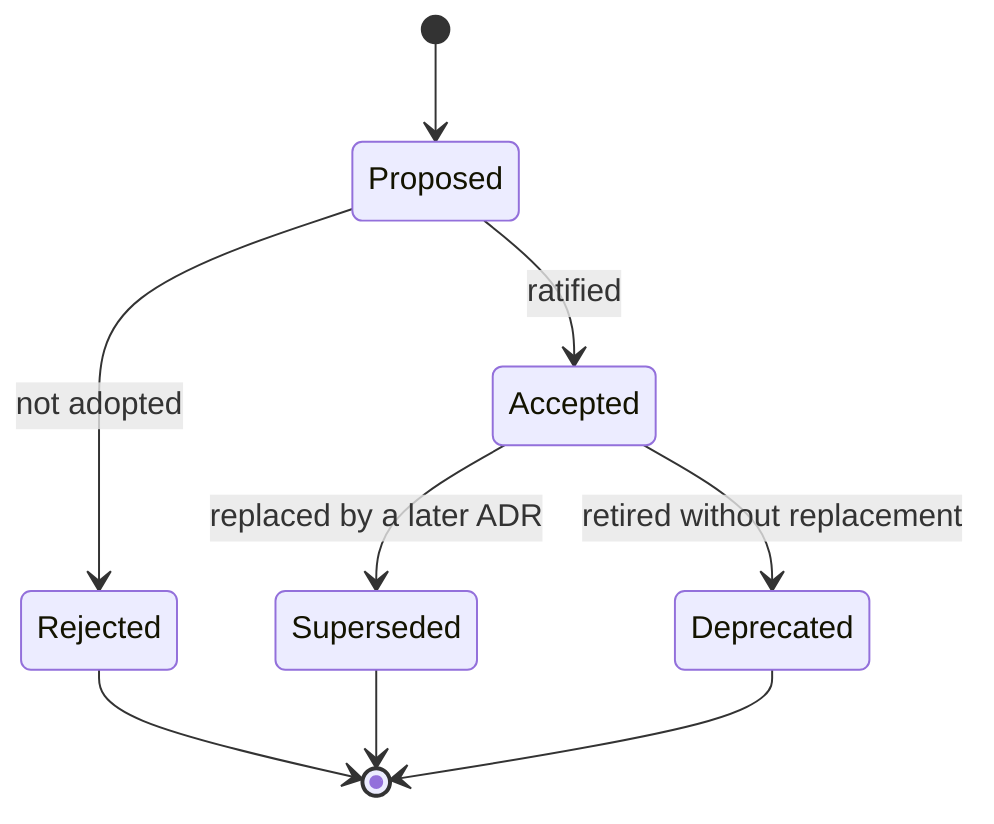

# ADR Lifecycle

This document defines the states an Architecture Decision Record passes through and the transitions
between them. The lifecycle makes the status of every decision unambiguous and preserves the full
decision history through immutability-by-supersession.

## States

| State | Meaning |
|-------|---------|
| **Proposed** | The decision is drafted and under review. It is not yet binding. |
| **Accepted** | The decision is ratified and binding. Its text is now immutable. |
| **Rejected** | The proposal was reviewed and not adopted. Retained for history. |
| **Superseded** | The decision was binding but has been replaced by a later ADR. Retained, marked, and pointing to its successor. |
| **Deprecated** | The decision is no longer recommended but has no direct successor; its subject matter is being retired rather than replaced. |

## Transitions

- **Proposed → Accepted.** The decision is ratified by the authority defined in
  [ADR Governance](ADR_GOVERNANCE.md). On acceptance, the body text becomes immutable; only status
  fields may change thereafter.
- **Proposed → Rejected.** The decision is not adopted. The record is retained so the rejected
  option and its reasoning remain visible; the number is not reused.
- **Accepted → Superseded.** A later ADR replaces this one. The new ADR names what it supersedes;
  this record's `Superseded By` field is set to point to the successor. **No other field is
  altered.**
- **Accepted → Deprecated.** The decision's subject is being retired with no direct successor (for
  example, a capability the framework no longer describes). The record is marked Deprecated with a
  note explaining the retirement.

## Immutability and supersession

Once **Accepted**, an ADR is never edited. If the decision must change, a new ADR is authored with
the next available number, stating what it supersedes. This mirrors the immutability rule of the
Foundation register (`ARCHITECTURE_DECISIONS.md` §8): change occurs only by supersession, history
is always preserved, and identifiers are permanent. A superseding ADR may itself later be
superseded, forming a traceable chain.

## Retirement

Retirement is the deliberate end of a decision's applicability. It occurs by one of two paths:

- **Supersession** — the decision is replaced; use when a successor decision exists.
- **Deprecation** — the decision's subject is withdrawn; use when nothing replaces it.

In neither case is the ADR deleted. Retired ADRs remain in [`decisions/`](decisions/) and in the
[Index](ADR_INDEX.md), clearly marked, so the decision history is complete and auditable.

## Status in the index

Every state transition is reflected in the [ADR Index](ADR_INDEX.md), which records each ADR's
current status and, where applicable, its supersession link. The index is the fastest view of the
decision log's current state; the individual records are the authoritative detail.

## Relationships

- Governed by [ADR Governance](ADR_GOVERNANCE.md) (who ratifies transitions).
- Applies the immutability principle of the Foundation
  [Architecture Decisions](../bootstrap/ARCHITECTURE_DECISIONS.md).
- Surfaced through the [ADR Index](ADR_INDEX.md).
