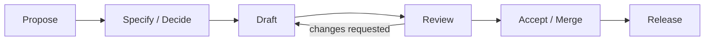

# Workflow

The Workflow document describes the day-to-day process for contributing to APEF: how an idea moves
from proposal, through specification and drafting, to a reviewed, accepted artifact. It is the
operational counterpart to the [`ENGINEERING_GUIDE.md`](ENGINEERING_GUIDE.md) (how to work) and the
[`REPOSITORY_GUIDE.md`](REPOSITORY_GUIDE.md) (where work belongs). It describes process only; it
prescribes no tooling.

## The contribution flow

### 1 · Propose
State the intent and its motivation. Confirm the contribution has a single home per the
[Repository Guide](REPOSITORY_GUIDE.md) and identify its owning Handbook chapter. A proposal that
spans two homes is split into separate contributions.

### 2 · Specify / Decide
Capture intent before realizing it, per Specification-Driven Development:

- For work that realizes a capability or requirement, author the appropriate specification from the
  [Specification Library](../specifications/SPECIFICATION_LIBRARY_INDEX.md), traced to its origin.
- For an architecturally significant choice, write an ADR using the
  [ADR template](../adrs/ADR_TEMPLATE.md), following the [ADR lifecycle](../adrs/ADR_LIFECYCLE.md);
  accepted ADRs land in [`../adrs/`](../adrs/).
- Trivial, non-significant changes may skip specification and go straight to drafting.

### 3 · Draft
Author the artifact against its template and the [Documentation Conventions](../governance/DOCUMENTATION_CONVENTIONS.md):
eight-section READMEs, the twelve-section chapter template, single concept ownership, resolvable
links, and no placeholders. Frozen READMEs are never modified; authoritative content goes in entry
documents (Module Entry Pattern).

### 4 · Review
Review the draft against the [Review Framework](../execution/REVIEW_FRAMEWORK.md) dimensions and, for
specifications, the [Specification Review](../specifications/SPECIFICATION_REVIEW.md). Requested
changes return the work to drafting. Review is where the content is judged — objective, and
against a stated definition of done.

### 5 · Accept / Merge
The change is accepted only when every applicable gate in [`QUALITY_GATES.md`](QUALITY_GATES.md)
passes and its definition of done is met. Committing follows the
[Version Control Policy](../governance/VERSION_CONTROL_POLICY.md): work is committed as one
logical commit per approved milestone, using Conventional Commits, only after Board approval —
never speculatively mid-milestone.

### 6 · Release
Accepted work is consolidated into a version through the [`RELEASE_PROCESS.md`](RELEASE_PROCESS.md).

## Where the gates apply

| Gate | Applied at |
|------|-----------|
| G-1 Structural conformance · G-3 Single-ownership | Propose and Draft |
| G-2 Completeness · G-4 Link integrity · G-5 Neutrality | Draft and Review |
| G-6 Traceability · G-7 Decision integrity | Specify/Decide and Review |
| G-8 Consistency | Review |
| All gates (scope-wide) | Release |

## Branching and commits

Work proceeds on a topic branch, never directly on the default branch. Commits are grouped
logically and follow Conventional Commits. Commit and tag timing is governed by the
[Version Control Policy](../governance/VERSION_CONTROL_POLICY.md): approval precedes commit, one
milestone maps to one logical commit, and tags are applied only at publication milestones.

## Relationships

- Operational counterpart to [`ENGINEERING_GUIDE.md`](ENGINEERING_GUIDE.md) and
  [`REPOSITORY_GUIDE.md`](REPOSITORY_GUIDE.md); applies the [`QUALITY_GATES.md`](QUALITY_GATES.md)
  and feeds the [`RELEASE_PROCESS.md`](RELEASE_PROCESS.md).
- Aligns with [`../CONTRIBUTING.md`](../CONTRIBUTING.md) at the repository root and the
  [Version Control Policy](../governance/VERSION_CONTROL_POLICY.md).
