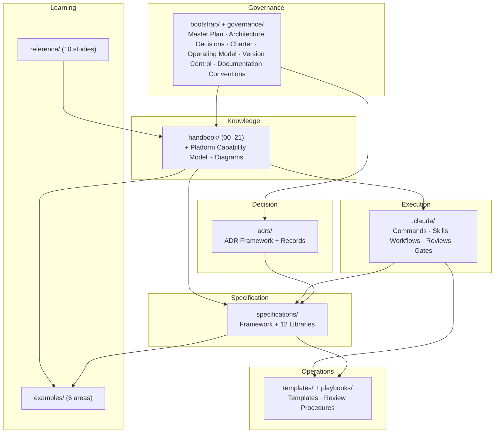

# APEF Framework Map

The top-level map of the Agent Platform Engineering Framework (APEF) at Release Candidate for
v1.0. It shows the framework's layers and how they relate. It is a navigation and publication
artifact; the [Handbook](../handbook/HANDBOOK_SUMMARY.md) remains the normative source of truth.

## Layers

| Layer | Where | What it provides |
|-------|-------|------------------|
| **Governance** | [`bootstrap/`](../bootstrap/), [`governance/`](../governance/README.md) | The constitution, ratified decisions, and roadmap (bootstrap), and the Architecture Governance Package — [Charter](../governance/ARCHITECTURE_CHARTER.md), Board, Operating Model, Escalation, Team Rules, [Version Control Policy](../governance/VERSION_CONTROL_POLICY.md), and [Documentation Conventions](../governance/DOCUMENTATION_CONVENTIONS.md). |
| **Knowledge** | [`handbook/`](../handbook/HANDBOOK_SUMMARY.md) | The 22-chapter Engineering Handbook, the [Platform Capability Model](../handbook/PLATFORM_CAPABILITY_MODEL.md), and the [Conceptual Diagrams](../handbook/CONCEPTUAL_DIAGRAMS.md). |
| **Execution** | [`.claude/`](../.claude/EXECUTION_FRAMEWORK.md) | The engineering operating system: commands, skills, workflows, review framework, and quality gates. |
| **Specification** | [`specifications/`](../specifications/SPECIFICATION_FRAMEWORK.md) | The Specification Framework and the twelve-area Specification Library. |
| **Decision** | [`adrs/`](../adrs/ADR_FRAMEWORK.md) | The ADR engineering framework — lifecycle, governance, template, index, categories, and the [decision records](../adrs/ADR_INDEX.md). |
| **Operations** | [`templates/`](../templates/TEMPLATE_OWNERSHIP.md), [`playbooks/`](../playbooks/) | The template ownership model and reusable forms, and the governance/quality review procedures (architecture, security, release). |
| **Learning** | [`reference/`](../reference/REFERENCE_INDEX.md), [`examples/`](../examples/EXAMPLES_INDEX.md) | Analytical studies of external technologies and neutral worked examples of APEF concepts. |
| **Foundation** | repository structure | The complete directory structure, with a contract README in every directory. |

## Map (conceptual)

## How the layers relate

- **Governance** authorizes and constrains all work; the Handbook is normative.
- **Knowledge** (the Handbook) is the source of truth every other layer conforms to and
  references; the Platform Capability Model is its canonical conceptual model.
- **Execution** operationalizes the Handbook into repeatable commands, skills, and workflows.
- **Specification** defines how intent becomes specified work before implementation, consistent
  with the Handbook and the Execution Framework.
- **Decision** records every architecturally significant choice as an ADR, governed and traceable,
  interoperating with the immutable Foundation register and the Documentation Conventions standard.
- **Operations** provides the reusable templates (one home per type) and the governance/quality
  review procedures that operationalize the Charter, the security dimension, and the Release Process.
- **Learning** informs the framework (reference studies) and demonstrates it (examples), both
  without prescribing technology.

## Entry points

- Framework index: [FRAMEWORK_INDEX.md](FRAMEWORK_INDEX.md)
- Publication readiness: [PUBLICATION_READINESS.md](PUBLICATION_READINESS.md)
- Release candidate: [RELEASE_CANDIDATE.md](RELEASE_CANDIDATE.md)
- Final review: [FINAL_ARCHITECTURE_REVIEW.md](FINAL_ARCHITECTURE_REVIEW.md)
