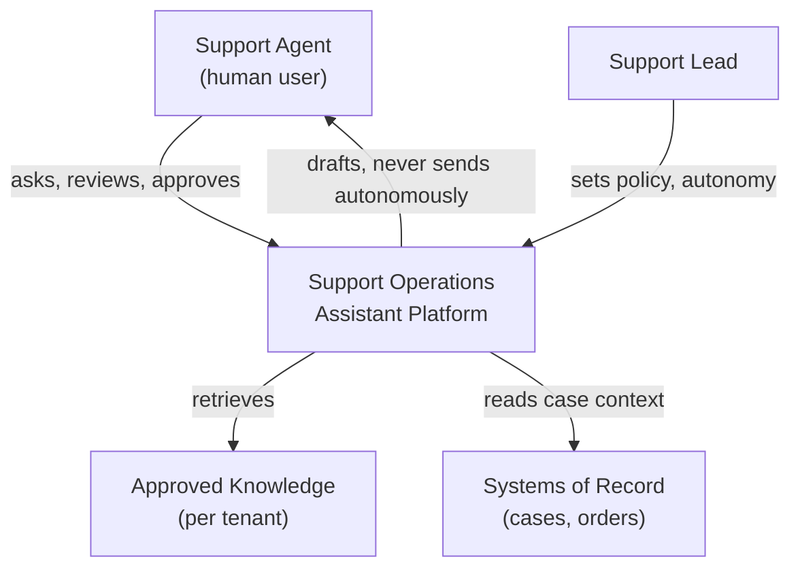
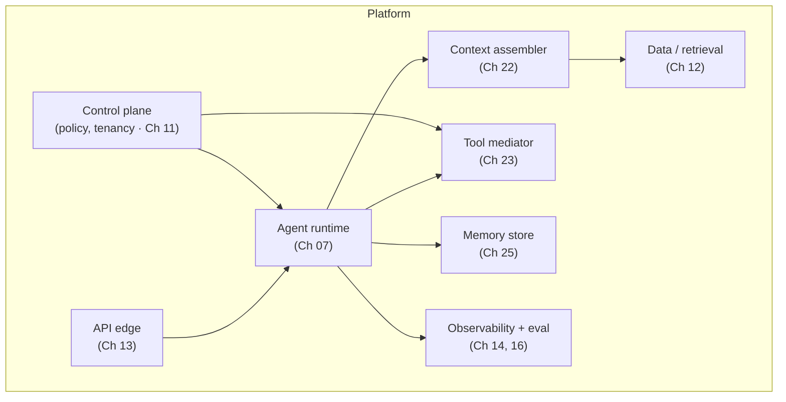

# Reference Platform — Design

*Applies APEF steps 1–4 (vision → domain → architecture → capabilities) to the Support Operations
Assistant Platform. Non-executable and technology-neutral.*

## Vision (step 1)

- **What it is.** A platform for building and operating support-assistant agents across many internal
  support teams.
- **Whom it serves.** Support agents (the human operators) as primary users; support leads and
  platform engineers as secondary. End customers are served *indirectly* — the assistant helps the
  human help them.
- **The outcome.** Faster, more consistent, policy-safe support responses, with the human always in
  control of anything customer-facing.
- **Non-goals.** It does not replace the support agent, does not act on customers autonomously, and
  does not own the systems of record it reads from.

## Capabilities (step 4, surfaced early)

Named from the user's point of view (each would be a capability specification):

1. **Answer a support question** from approved, tenant-scoped knowledge, with citations.
2. **Look up case context** (read-only) from systems of record.
3. **Draft a customer response** for the human to review, edit, and send.
4. **Escalate** a case with a structured summary when policy or confidence requires it.
5. **Operate per tenant** — each team's knowledge, policies, and autonomy limits are isolated.

## Domain (step 2)

Bounded contexts (from a domain exploration):

- **Assistance** — the conversation and the assistant's reasoning about a support question.
- **Knowledge** — the tenant-scoped corpus the assistant may draw on.
- **Case** — the support case being worked (owned by the systems of record; the platform holds a
  read model).
- **Policy** — the tenant's rules: what may be answered, what may be actioned, and the autonomy
  limits.

Representative domain events: *Question Received*, *Answer Proposed*, *Response Drafted*, *Action
Requested*, *Action Approved*, *Case Escalated*. Aggregates cluster around the **Assistance Session**
(consistency boundary for one conversation) and the **Policy Set** (per tenant).

## Architecture (step 3)

Anchored on the reference architecture's planes. Two C4 views follow (diagram-as-code, neutral).

### Context view

### Container view (platform planes)

The structure is nothing exotic — it is the reference architecture's planes, made specific: the
runtime executes the assistant; the context assembler builds each call's context from knowledge,
history, and policy; the tool mediator bounds actions; the control plane enforces tenancy and policy;
observability and evaluation watch behavior. Each box names its owning Handbook chapter; this instance
defines none of those concepts, it applies them.

## What steps 1–4 produced

A vision with explicit non-goals, five user-framed capabilities, four bounded contexts with events and
aggregates, and two architecture views placing the work on the reference planes — a coherent design
skeleton, all traceable, before a single agentic detail is decided. The agentic core follows in
[`02-agentic-engineering.md`](02-agentic-engineering.md).
