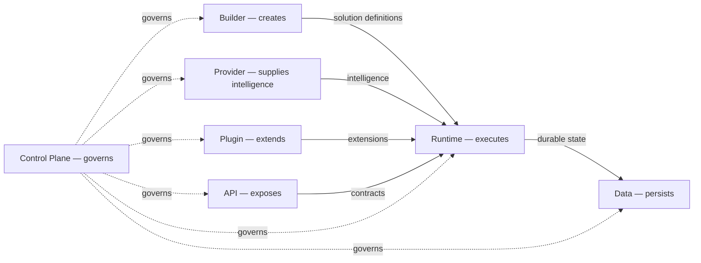
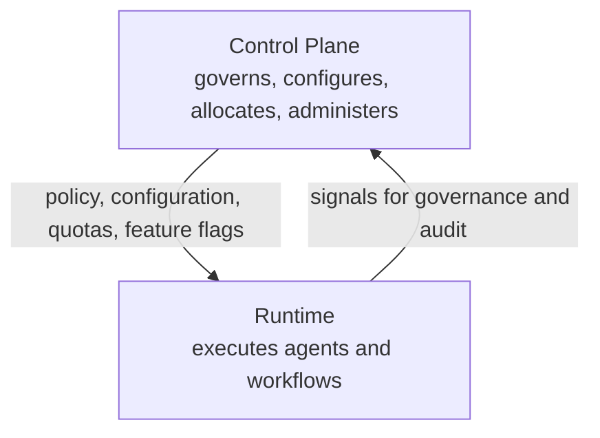
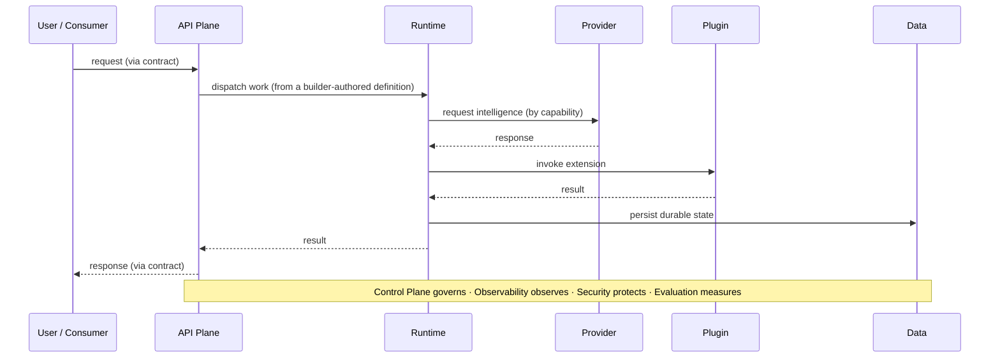
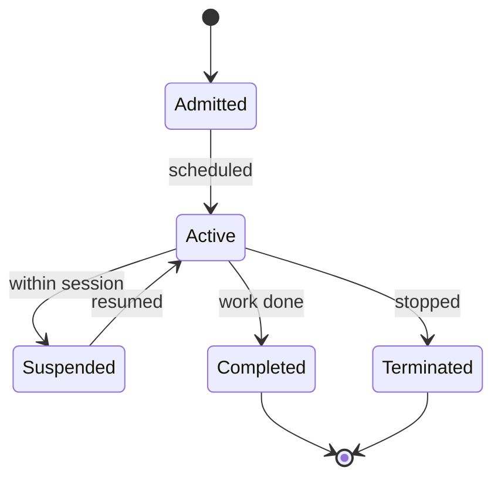

# Conceptual Diagrams

The conceptual diagrams of the APEF Engineering Handbook. They explain architectural
concepts; they are **not** implementation diagrams and contain no technology, product, or
mechanism. Each is expressed as diffable diagram-as-code (Mermaid) and is consistent with
the [Platform Capability Model](PLATFORM_CAPABILITY_MODEL.md) and the frozen chapters.

## 1. Platform Capability Model

The canonical model of the platform as independent capabilities is maintained in the
[Platform Capability Model](PLATFORM_CAPABILITY_MODEL.md), where its diagram appears. It is
the first of this Handbook's conceptual diagrams.

## 2. Platform Operational Architecture

The operational relationships among the platform planes: each plane has one concern, and the
control plane governs all of them while the cross-cutting capabilities apply across all of
them.

Cross-cutting capabilities — observability, security, evaluation, and experience — apply
within every plane above and are not shown as separate boxes to keep the concern separation
clear.

## 3. Control Plane versus Runtime

The defining separation of governance from execution: the control plane manages the
platform but never executes business workloads; the runtime executes workloads but never
governs the platform.

The control plane never executes workloads; the runtime never governs the platform. Each
depends on the other across an explicit boundary, and neither performs the other's role.

## 4. End-to-End Platform Interaction Model

How a request is served end to end, conceptually: a consumer interacts through the API
plane's contract; the runtime executes the work defined by the builder, drawing intelligence
from the provider plane and extensions from the plugin plane, and persisting durable state
through the data plane — all governed, observed, secured, and evaluated by the cross-cutting
capabilities.

## 5. AI Agent Operational Lifecycle

The lifecycle an agent passes through under the runtime's care, as owned by
[Chapter 07 — Runtime Platform](07-runtime-platform/CHAPTER.md). Governance, observation, and
security apply throughout.

Throughout every stage the control plane governs what may run, observability emits signals,
security applies its principles, and the data plane persists what must endure — while the
runtime alone executes.

## Conventions

- These diagrams are conceptual and technology-neutral; they name capabilities and
  relationships, never technologies or products.
- They are kept consistent with the [Platform Capability Model](PLATFORM_CAPABILITY_MODEL.md)
  and the frozen chapters; if the model changes, the diagrams change with it.
