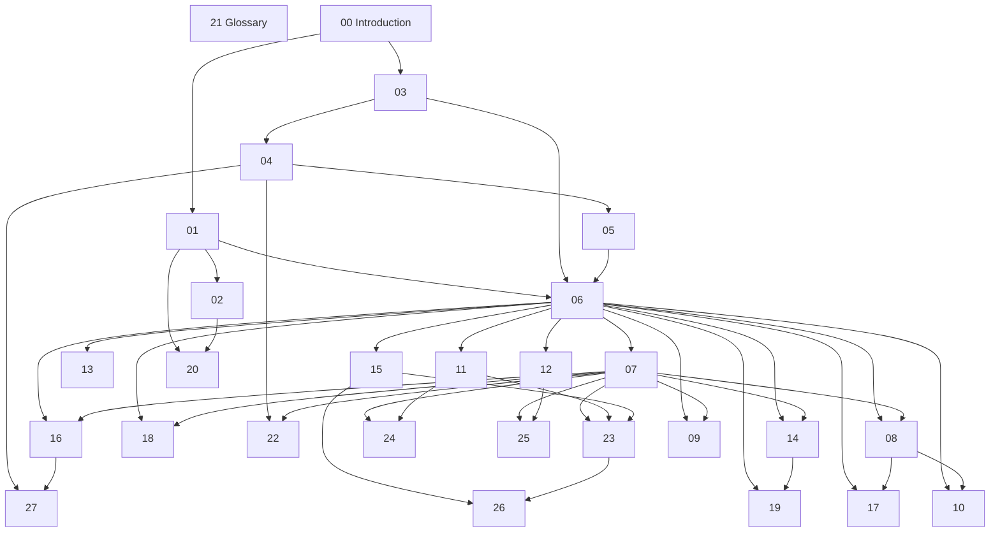

# Engineering Handbook — Knowledge Graph

This document describes how chapters depend on each other. Its purpose is to guarantee a logical reading order, prevent circular dependencies, and **minimize duplicated knowledge**: each concept is owned by exactly one chapter, and every other chapter links to the owner instead of redefining it.

Dependencies are **acyclic**: a prerequisite always points to a lower-numbered chapter, and any reference to a higher-numbered chapter is a non-binding *related* link, never a prerequisite.

## Prerequisite dependency graph

> **Ratified clarification (Architecture Hub).** Chapter 06 is intentionally the architecture hub. Its dependency concentration is an accepted design choice, not a defect: it gives every plane and cross-cutting chapter one consistent architectural anchor.

## Prerequisite adjacency (mandatory reading)

| Chapter | Direct prerequisites |
|---------|----------------------|
| [00 — Introduction](00-introduction/) | None |
| [01 — Platform Vision](01-platform-vision/) | [00 — Introduction](00-introduction/) |
| [02 — Product Thinking](02-product-thinking/) | [01 — Platform Vision](01-platform-vision/) |
| [03 — Engineering Principles](03-engineering-principles/) | [00 — Introduction](00-introduction/) |
| [04 — Development Methodology](04-development-methodology/) | [03 — Engineering Principles](03-engineering-principles/) |
| [05 — Domain-Driven Design](05-domain-driven-design/) | [04 — Development Methodology](04-development-methodology/) |
| [06 — Reference Architecture](06-reference-architecture/) | [01 — Platform Vision](01-platform-vision/), [03 — Engineering Principles](03-engineering-principles/), [05 — Domain-Driven Design](05-domain-driven-design/) |
| [07 — Runtime Platform](07-runtime-platform/) | [06 — Reference Architecture](06-reference-architecture/) |
| [08 — Builder Platform](08-builder-platform/) | [06 — Reference Architecture](06-reference-architecture/), [07 — Runtime Platform](07-runtime-platform/) |
| [09 — Provider Platform](09-provider-platform/) | [06 — Reference Architecture](06-reference-architecture/), [07 — Runtime Platform](07-runtime-platform/) |
| [10 — Plugin Platform](10-plugin-platform/) | [06 — Reference Architecture](06-reference-architecture/), [08 — Builder Platform](08-builder-platform/) |
| [11 — Control Plane](11-control-plane/) | [06 — Reference Architecture](06-reference-architecture/) |
| [12 — Data Platform](12-data-platform/) | [06 — Reference Architecture](06-reference-architecture/) |
| [13 — API Platform](13-api-platform/) | [06 — Reference Architecture](06-reference-architecture/) |
| [14 — Observability](14-observability/) | [06 — Reference Architecture](06-reference-architecture/), [07 — Runtime Platform](07-runtime-platform/) |
| [15 — Security](15-security/) | [06 — Reference Architecture](06-reference-architecture/) |
| [16 — Evaluation](16-evaluation/) | [06 — Reference Architecture](06-reference-architecture/), [07 — Runtime Platform](07-runtime-platform/) |
| [17 — User Experience](17-ui-ux/) | [06 — Reference Architecture](06-reference-architecture/), [08 — Builder Platform](08-builder-platform/) |
| [18 — Testing](18-testing/) | [06 — Reference Architecture](06-reference-architecture/), [07 — Runtime Platform](07-runtime-platform/) |
| [19 — DevOps](19-devops/) | [06 — Reference Architecture](06-reference-architecture/), [14 — Observability](14-observability/) |
| [20 — Roadmap](20-roadmap/) | [01 — Platform Vision](01-platform-vision/), [02 — Product Thinking](02-product-thinking/) |
| [21 — Glossary](21-glossary/) | None |
| [22 — Context & Prompt Engineering](22-context-and-prompt-engineering/) | [04 — Development Methodology](04-development-methodology/), [07 — Runtime Platform](07-runtime-platform/) |
| [23 — Tool & Function Architecture](23-tool-and-function-architecture/) | [07 — Runtime Platform](07-runtime-platform/), [11 — Control Plane](11-control-plane/), [15 — Security](15-security/) |
| [24 — Multi-Agent Coordination](24-multi-agent-coordination/) | [07 — Runtime Platform](07-runtime-platform/), [11 — Control Plane](11-control-plane/) |
| [25 — Memory & Conversational State](25-memory-and-conversational-state/) | [07 — Runtime Platform](07-runtime-platform/), [12 — Data Platform](12-data-platform/) |
| [26 — Agentic Security](26-agentic-security/) | [15 — Security](15-security/), [23 — Tool & Function Architecture](23-tool-and-function-architecture/) |
| [27 — Evaluation-Driven Development](27-evaluation-driven-development/) | [04 — Development Methodology](04-development-methodology/), [16 — Evaluation](16-evaluation/) |

## Reading tiers

- **Orientation:** [00 — Introduction](00-introduction/)
- **Why the platform exists:** [01 — Platform Vision](01-platform-vision/), [02 — Product Thinking](02-product-thinking/)
- **How we work:** [03 — Engineering Principles](03-engineering-principles/), [04 — Development Methodology](04-development-methodology/), [05 — Domain-Driven Design](05-domain-driven-design/)
- **Architecture core:** [06 — Reference Architecture](06-reference-architecture/)
- **Platform planes:** [07 — Runtime Platform](07-runtime-platform/), [08 — Builder Platform](08-builder-platform/), [09 — Provider Platform](09-provider-platform/), [10 — Plugin Platform](10-plugin-platform/), [11 — Control Plane](11-control-plane/), [12 — Data Platform](12-data-platform/), [13 — API Platform](13-api-platform/)
- **Cross-cutting concerns:** [14 — Observability](14-observability/), [15 — Security](15-security/), [16 — Evaluation](16-evaluation/), [17 — User Experience](17-ui-ux/), [18 — Testing](18-testing/), [19 — DevOps](19-devops/)
- **Direction:** [20 — Roadmap](20-roadmap/)
- **Reference (read anytime):** [21 — Glossary](21-glossary/)

## Independent and optional reading

- **Independent chapters** (no prerequisites): [00 — Introduction](00-introduction/), [21 — Glossary](21-glossary/). [21 — Glossary](21-glossary/) is a living reference and may be consulted at any point.
- **Optional reading:** every *related* link in the [Table of Contents](TABLE_OF_CONTENTS.md) is optional and non-binding. Related links may point forward (for example, [06 — Reference Architecture](06-reference-architecture/) relates to the plane chapters) without creating a dependency.

## Concept ownership (duplication control)

Each concept is defined once, by its owning chapter. Other chapters reference the owner rather than restating the concept.

| Owning chapter | Concept it owns |
|----------------|-----------------|
| [01 — Platform Vision](01-platform-vision/) | Platform vision, outcomes, and success criteria |
| [02 — Product Thinking](02-product-thinking/) | Platform users, jobs-to-be-done, and prioritization |
| [03 — Engineering Principles](03-engineering-principles/) | Engineering principles and trade-off resolution |
| [04 — Development Methodology](04-development-methodology/) | Specification-Driven Development and ADR practice |
| [05 — Domain-Driven Design](05-domain-driven-design/) | Domain modeling: bounded contexts and the ubiquitous-language method |
| [06 — Reference Architecture](06-reference-architecture/) | The reference architecture and the definition of the platform planes |
| [07 — Runtime Platform](07-runtime-platform/) | Runtime execution, state, and lifecycle |
| [08 — Builder Platform](08-builder-platform/) | Authoring model and developer experience |
| [09 — Provider Platform](09-provider-platform/) | Provider abstraction and integration contract |
| [10 — Plugin Platform](10-plugin-platform/) | Plugin/extensibility contract and lifecycle |
| [11 — Control Plane](11-control-plane/) | Governance, configuration, orchestration, and administration |
| [12 — Data Platform](12-data-platform/) | Persistence, retrieval, and data governance |
| [13 — API Platform](13-api-platform/) | API contracts, versioning, and the API edge |
| [14 — Observability](14-observability/) | Telemetry, tracing, and service-level objectives |
| [15 — Security](15-security/) | Threat model, identity, isolation, and agent-specific security |
| [16 — Evaluation](16-evaluation/) | Evaluation of AI systems: model-dependent behavioral quality, metrics, and continuous evaluation |
| [17 — User Experience](17-ui-ux/) | Interaction models and experience principles |
| [18 — Testing](18-testing/) | Testing of software systems: correctness of deterministic behavior |
| [19 — DevOps](19-devops/) | Delivery, infrastructure, and operational excellence |
| [20 — Roadmap](20-roadmap/) | Roadmap shaping and sequencing |
| [22 — Context & Prompt Engineering](22-context-and-prompt-engineering/) | Context assembly, prompt lifecycle, and the context budget |
| [23 — Tool & Function Architecture](23-tool-and-function-architecture/) | Tool contracts, permissioning, side-effect classes, and action reversibility |
| [24 — Multi-Agent Coordination](24-multi-agent-coordination/) | Multi-agent coordination: roles, topologies, handoffs, and convergence |
| [25 — Memory & Conversational State](25-memory-and-conversational-state/) | Agent memory: working vs long-term, scope, retention, and retrieval |
| [26 — Agentic Security](26-agentic-security/) | Agent-specific threats and controls: injection, guardrails, autonomy (extends Ch 15) |
| [27 — Evaluation-Driven Development](27-evaluation-driven-development/) | Evaluation-Driven Development: evaluation as a peer of specification, and the behavioral regression gate |

> **Ratified clarification (Glossary owns no concepts).** [21 — Glossary](21-glossary/) does not appear in the ownership table: it owns no concepts. It only standardizes terminology. The definition of every concept belongs to its owning chapter above; the Glossary provides the canonical term and links to that owner.

> **Ratified clarification (Evaluation vs Testing).** [16 — Evaluation](16-evaluation/) and [18 — Testing](18-testing/) are distinct disciplines and never merge: Evaluation addresses AI systems (model-dependent, non-deterministic behavior); Testing addresses software systems (deterministic correctness). This separation is maintained throughout the handbook.

> **Ratified clarification (Security is cross-cutting).** Security is not modeled as a dependency. [15 — Security](15-security/) owns security **principles**; any chapter may carry an optional *Security Considerations* section describing implementation implications, per the [Writing Guide](WRITING_GUIDE.md).
