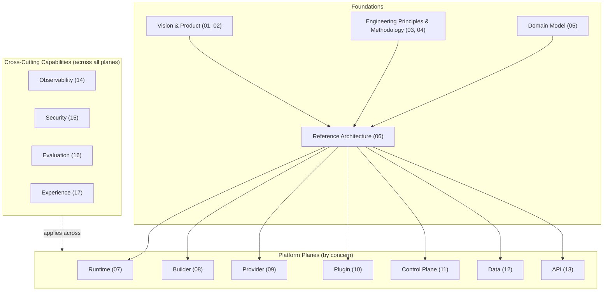

# Platform Capability Model (PCM)

The Platform Capability Model is the canonical conceptual model of the APEF Engineering
Handbook. It represents an AI Agent Platform as a set of **independent architectural
capabilities** — not as technologies, products, or a particular system. Its purpose is to
give the whole Handbook one shared model: every chapter defines or applies a capability in
the PCM, and every capability has exactly one owning chapter.

This is a conceptual model. It contains no implementation, no technology, and no product.

## Purpose

- Provide a single, technology-neutral mental model of the platform for the whole Handbook.
- Express the platform as capabilities with clear responsibilities and boundaries, so that
  concerns stay separate and ownership stays single.
- Serve as the reference every chapter situates itself within.

## The model

The PCM groups the platform's capabilities into three bands: the **foundations** that
justify and shape the platform, the **platform planes** that divide it by concern, and the
**cross-cutting capabilities** that apply across all planes. The foundations are established
in Chapters 01–06; the planes and cross-cutting capabilities are the operational
capabilities of the platform.

## How to read it

- A **plane** is a concern the platform is divided by (execution, creation, intelligence,
  extension, governance, persistence, interaction). Planes interact only across explicit
  architectural boundaries.
- A **cross-cutting capability** is not a plane; it applies within every plane
  (observability, security, evaluation, experience).
- The **foundations** are not operated at run time; they justify and shape the platform.
- Each capability is **independent**: it has one responsibility and one owning chapter, and
  it can be reasoned about, and evolve, on its own.

## Capability ownership

| Capability | Owning chapter |
|------------|----------------|
| Vision, outcomes | 01 Platform Vision |
| Product philosophy | 02 Product Thinking |
| Engineering principles | 03 Engineering Principles |
| Development methodology | 04 Development Methodology |
| Domain model | 05 Domain-Driven Design |
| Reference architecture | 06 Reference Architecture |
| Runtime plane | 07 Runtime Platform |
| Builder plane | 08 Builder Platform |
| Provider plane | 09 Provider Platform |
| Plugin plane | 10 Plugin Platform |
| Control plane | 11 Control Plane |
| Data plane | 12 Data Platform |
| API plane | 13 API Platform |
| Observability | 14 Observability |
| Security | 15 Security |
| Evaluation | 16 Evaluation |
| Experience | 17 User Experience |

## Relationships

- [Reference Architecture](06-reference-architecture/CHAPTER.md) — owns platform planes,
  which the PCM organizes.
- [Conceptual Diagrams](CONCEPTUAL_DIAGRAMS.md) — the sprint's conceptual diagrams, of which
  the model above is the first.
- [Knowledge Graph](KNOWLEDGE_GRAPH.md) — the chapter dependency and ownership graph the PCM
  is consistent with.

## Conventions

- The PCM is the canonical conceptual model; chapters situate themselves within it and never
  contradict it.
- The model is technology-neutral: it names capabilities, never technologies.
- Chapters authored from Sprint 04 onward reference the PCM; frozen chapters (00–12) are
  consistent with it and may be linked to it in a future editorial pass.
