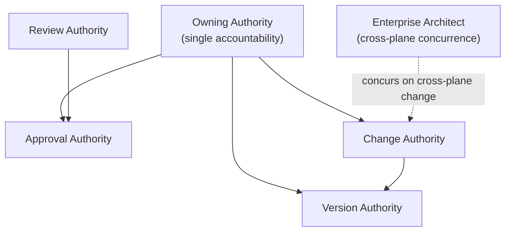

# Specification Governance

Governance defines who owns, approves, reviews, changes, and versions a specification. It keeps
every specification singly owned and every change authorized, so the specification body stays
coherent and trustworthy. It is part of the
[Specification Framework](SPECIFICATION_FRAMEWORK.md).

## Ownership model

| Ownership form | Meaning |
|----------------|---------|
| **Single ownership** | Every specification has exactly one owning authority and one owning Handbook concern. There is no shared ownership. |
| **Referenced ownership** | A specification may reference concepts and specifications owned elsewhere; it never redefines or re-owns them. |
| **Delegation** | An owner may delegate authoring, but not ownership; accountability remains with the single owner. |

## Authorities

Each specification is governed by five authorities. For a given category, these are held by the
skills mapped in the [Taxonomy](SPECIFICATION_TAXONOMY.md) and the
[Execution Framework](../execution/SKILL_CATALOG.md).

| Authority | Owns the decision to… | Typically held by |
|-----------|-----------------------|-------------------|
| **Approval authority** | Approve a specification into the normative state. | The owning concern's lead architect / Product Architect |
| **Review authority** | Assess the specification and rule on its review dimensions. | The dimension owners (see [Specification Review](SPECIFICATION_REVIEW.md)) |
| **Change authority** | Deprecate or supersede an approved specification. | The owning authority, with Enterprise-Architect concurrence for cross-plane impact |
| **Version authority** | Create versions and archive superseded records. | The owning authority |
| **Owning authority** | Hold single accountability for the specification. | The Handbook concern's owner |

## Change governance

- An **Approved** specification is never edited in place. A change produces a **new version**
  that re-enters the lifecycle at Draft.
- A change with cross-plane impact requires the Enterprise Architect's concurrence, preserving
  whole-of-platform coherence.
- Every change is recorded, and its rationale, where significant, is captured as an ADR
  referenced by the specification.
- **Superseded** and **Archived** specifications are immutable and retained for traceability.

## Governance model (conceptual)

## Governance principles

- **One owner, always.** No specification is ownerless or co-owned.
- **Reference, never redefine.** Referenced ownership never becomes redefinition.
- **Authorized change only.** Every change passes through the change and version authorities.
- **Immutable history.** Superseded and archived specifications are never altered.
- **Coherence preserved.** Cross-plane change requires Enterprise-Architect concurrence.
