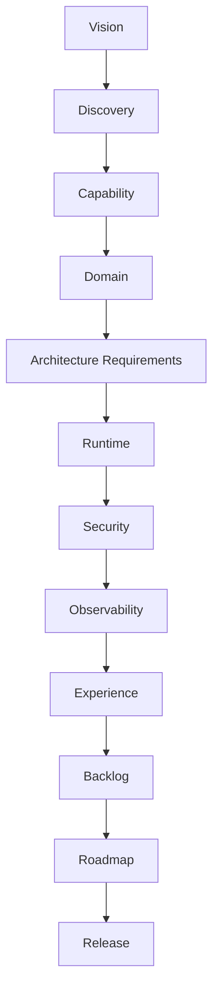

# Specification Library Index

The primary navigation artifact for the APEF Specification Library. It indexes all twelve specification areas, the specification types each owns, and the matrices that relate them. Layer 1 (how specifications work) is defined by the framework documents; Layer 2 (what kinds of specifications exist) is the twelve libraries below.

## Layer 1 — Specification Framework

- [Specification Framework](SPECIFICATION_FRAMEWORK.md) · [Lifecycle](SPECIFICATION_LIFECYCLE.md) · [Taxonomy](SPECIFICATION_TAXONOMY.md) · [Governance](SPECIFICATION_GOVERNANCE.md) · [Traceability](SPECIFICATION_TRACEABILITY.md) · [Review](SPECIFICATION_REVIEW.md) · [Completion](SPECIFICATION_COMPLETION.md) · [Relationships](SPECIFICATION_RELATIONSHIPS.md)

## Layer 2 — Specification Libraries

Twelve areas, 87 owned specification types.

- [Vision](./vision/VISION_SPECIFICATIONS.md) — owns 7 types; owner Product/Enterprise Architect; chapter [01](../handbook/01-platform-vision/CHAPTER.md).
- [Discovery](./discovery/DISCOVERY_SPECIFICATIONS.md) — owns 8 types; owner Product Architect; chapter [02](../handbook/02-product-thinking/CHAPTER.md).
- [Capability](./capabilities/CAPABILITY_SPECIFICATIONS.md) — owns 5 types; owner Product Architect; chapter [02](../handbook/02-product-thinking/CHAPTER.md).
- [Domain](./domains/DOMAIN_SPECIFICATIONS.md) — owns 5 types; owner Domain Expert; chapter [05](../handbook/05-domain-driven-design/CHAPTER.md).
- [Architecture Requirements](./architecture-requirements/ARCHITECTURE_REQUIREMENTS_SPECIFICATIONS.md) — owns 10 types; owner Platform Architect; chapter [06](../handbook/06-reference-architecture/CHAPTER.md).
- [Runtime](./runtime/RUNTIME_SPECIFICATIONS.md) — owns 6 types; owner Runtime Architect; chapter [07](../handbook/07-runtime-platform/CHAPTER.md).
- [Security](./security/SECURITY_SPECIFICATIONS.md) — owns 7 types; owner Security Architect; chapter [15](../handbook/15-security/CHAPTER.md).
- [Observability](./observability/OBSERVABILITY_SPECIFICATIONS.md) — owns 8 types; owner Observability Architect; chapter [14](../handbook/14-observability/CHAPTER.md).
- [Experience](./ui/EXPERIENCE_SPECIFICATIONS.md) — owns 6 types; owner Product Architect/Technical Writer; chapter [17](../handbook/17-ui-ux/CHAPTER.md).
- [Backlog](./backlog/BACKLOG_SPECIFICATIONS.md) — owns 10 types; owner Product Architect; chapter [04](../handbook/04-development-methodology/CHAPTER.md).
- [Roadmap](./roadmap/ROADMAP_SPECIFICATIONS.md) — owns 6 types; owner Product/Enterprise Architect; chapter [20](../handbook/20-roadmap/CHAPTER.md).
- [Release](./releases/RELEASE_SPECIFICATIONS.md) — owns 9 types; owner Platform/Observability Architect; chapter [19](../handbook/19-devops/CHAPTER.md).

## Ownership Matrix

| Library | Owned specification types | Owning chapter | Owning authority |
|---------|---------------------------|----------------|------------------|
| [Vision](./vision/VISION_SPECIFICATIONS.md) | Vision Specifications; Mission Specifications; Business Objectives; Product Outcomes; Success Metrics; Business Constraints; Strategic Assumptions | [01](../handbook/01-platform-vision/CHAPTER.md) | Product/Enterprise Architect |
| [Discovery](./discovery/DISCOVERY_SPECIFICATIONS.md) | Discovery Specifications; Stakeholders; Personas; Business Problems; Opportunities; Assumptions; Open Questions; Scope Discovery | [02](../handbook/02-product-thinking/CHAPTER.md) | Product Architect |
| [Capability](./capabilities/CAPABILITY_SPECIFICATIONS.md) | Capability Specifications; Capability Relationships; Capability Dependencies; Capability Boundaries; Capability Evolution | [02](../handbook/02-product-thinking/CHAPTER.md) | Product Architect |
| [Domain](./domains/DOMAIN_SPECIFICATIONS.md) | Domain Specifications; Bounded Context Specifications; Domain Responsibilities; Domain Relationships; Domain Boundaries | [05](../handbook/05-domain-driven-design/CHAPTER.md) | Domain Expert |
| [Architecture Requirements](./architecture-requirements/ARCHITECTURE_REQUIREMENTS_SPECIFICATIONS.md) | Architecture Drivers; Architecture Constraints; Quality Attribute Scenarios; Business Constraints; Regulatory Constraints; Technical Constraints; Architecture Risks; Trade-offs; Decision Forces; Architectural Assumptions | [06](../handbook/06-reference-architecture/CHAPTER.md) | Platform Architect |
| [Runtime](./runtime/RUNTIME_SPECIFICATIONS.md) | Runtime Specifications; Runtime Responsibilities; Runtime Constraints; Execution Models; Operational Behaviour; Lifecycle | [07](../handbook/07-runtime-platform/CHAPTER.md) | Runtime Architect |
| [Security](./security/SECURITY_SPECIFICATIONS.md) | Security Specifications; Security Requirements; Trust Boundaries; Security Constraints; Compliance Requirements; Privacy Requirements; Security Acceptance Criteria | [15](../handbook/15-security/CHAPTER.md) | Security Architect |
| [Observability](./observability/OBSERVABILITY_SPECIFICATIONS.md) | Observability Specifications; Metrics; Logs; Traces; Health; Monitoring; Operational Visibility; Observability Acceptance | [14](../handbook/14-observability/CHAPTER.md) | Observability Architect |
| [Experience](./ui/EXPERIENCE_SPECIFICATIONS.md) | Experience Specifications; Interaction Specifications; Navigation Specifications; Accessibility Specifications; Journey Specifications; Human Interaction Specifications | [17](../handbook/17-ui-ux/CHAPTER.md) | Product Architect/Technical Writer |
| [Backlog](./backlog/BACKLOG_SPECIFICATIONS.md) | Engineering Backlog; Capability Decomposition; Epics; Features; Stories; Tasks; Prioritization; Backlog Lifecycle; Backlog Governance; Traceability to Specifications | [04](../handbook/04-development-methodology/CHAPTER.md) | Product Architect |
| [Roadmap](./roadmap/ROADMAP_SPECIFICATIONS.md) | Roadmap Specifications; Evolution Strategy; Capability Evolution; Release Objectives; Strategic Themes; Future Planning | [20](../handbook/20-roadmap/CHAPTER.md) | Product/Enterprise Architect |
| [Release](./releases/RELEASE_SPECIFICATIONS.md) | Release Specifications; Release Scope; Acceptance; Readiness; Compatibility; Migration; Rollback Strategy; Release Validation; Release Governance | [19](../handbook/19-devops/CHAPTER.md) | Platform/Observability Architect |

## Dependency Matrix

| Library | Derives from (upstream) | Constrains (downstream) |
|---------|-------------------------|-------------------------|
| Vision | — (chain head) | [discovery](./discovery/) |
| Discovery | [vision](./vision/) | [capabilities](./capabilities/) |
| Capability | [discovery](./discovery/) | [domains](./domains/) |
| Domain | [capabilities](./capabilities/) | [architecture-requirements](./architecture-requirements/) |
| Architecture Requirements | [domains](./domains/) | [runtime](./runtime/) |
| Runtime | [architecture-requirements](./architecture-requirements/) | [security](./security/) |
| Security | [runtime](./runtime/) | [observability](./observability/) |
| Observability | [security](./security/) | [ui](./ui/) |
| Experience | [observability](./observability/) | [backlog](./backlog/) |
| Backlog | [ui](./ui/) | [roadmap](./roadmap/) |
| Roadmap | [backlog](./backlog/) | [releases](./releases/) |
| Release | [roadmap](./roadmap/) | — (chain tail) |

## Relationship Matrix

The conceptual chain (dependency, not implementation sequence):

Vision → Discovery → Capability → Domain → Architecture Requirements → Runtime → Security → Observability → Experience → Backlog → Roadmap → Release.

## Cross-reference Matrix

| Library | References | Review authority |
|---------|-----------|------------------|
| Vision | discovery | Business, Product |
| Discovery | vision, capabilities | Product, Domain |
| Capability | discovery, domains | Product, Architecture |
| Domain | capabilities, architecture-requirements | Domain, Architecture |
| Architecture Requirements | domains, runtime | Architecture, Security |
| Runtime | architecture-requirements, security | Runtime, Architecture |
| Security | runtime, observability | Security, Governance |
| Observability | security, ui | Observability, Operations |
| Experience | observability, backlog | Product, Documentation |
| Backlog | ui, roadmap | Product, Governance |
| Roadmap | backlog, releases | Product, Business |
| Release | roadmap | Operations, Testing |

## Traceability Matrix

Every library's specifications trace bidirectionally to the following targets (see [Traceability](SPECIFICATION_TRACEABILITY.md)):

| Trace target | Applies to |
|--------------|-----------|
| Vision | vision library |
| Business Goals | vision |
| Capability | capabilities |
| Domain | domains |
| Architecture | architecture-requirements |
| ADR | the governing decisions |
| Testing | release/testing verification |
| Evaluation | AI-quality verification |
| Deployment | releases |
| Operations | observability/releases |
| Acceptance | the specification's acceptance criteria |
| Completion | the specification's completion gates |
| Review | the applicable review dimensions |

## Cross-library relationships (conceptual)

Each library derives from the one above and constrains the one below; the chain expresses responsibility and dependency, never an implementation sequence.
