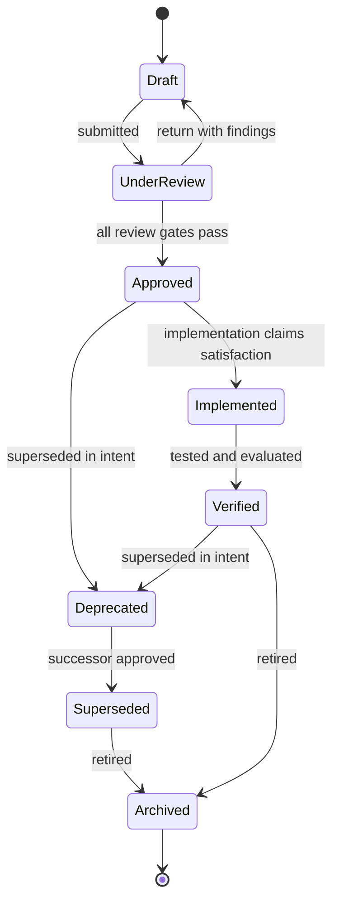
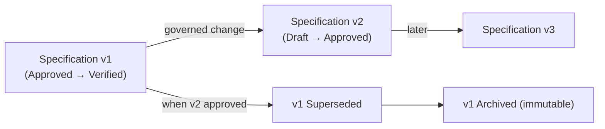

# Specification Lifecycle

Every specification in the APEF moves through a defined lifecycle of states, with explicit
transition rules, ownership, and responsibilities. The lifecycle makes the status of any
specification unambiguous and its progression governed. It is part of the
[Specification Framework](SPECIFICATION_FRAMEWORK.md).

## Lifecycle states

| State | Meaning |
|-------|---------|
| **Draft** | Authored and evolving; not yet submitted for review. |
| **Under Review** | Submitted; being assessed against the review dimensions. |
| **Approved** | Reviewed and accepted; normative and ready to be satisfied. |
| **Implemented** | An implementation claims to satisfy it; awaiting verification. |
| **Verified** | Verified (tested and, where applicable, evaluated) to be satisfied. |
| **Deprecated** | Still present but discouraged; scheduled to be replaced or removed. |
| **Superseded** | Replaced by a named successor specification; retained for history. |
| **Archived** | Retired from active use; retained as an immutable record. |

## Transition rules

A specification advances only when the transition's conditions are met; each transition is
owned by the authority stated below.

| From → To | Condition | Owned by |
|-----------|-----------|----------|
| Draft → Under Review | The specification is complete against its template. | Owning author |
| Under Review → Draft | Review returns findings requiring rework. | Review authority |
| Under Review → Approved | All applicable review dimensions pass their gates. | Approval authority |
| Approved → Implemented | An implementation is produced that claims satisfaction. | Owning author |
| Implemented → Verified | Testing and evaluation confirm the acceptance criteria. | Review authority |
| Approved/Verified → Deprecated | The specification is superseded in intent but not yet replaced. | Change authority |
| Deprecated → Superseded | A named successor is approved. | Change authority |
| Any → Archived | The specification is retired; its record is preserved. | Version authority |

Transitions are one-directional except *Under Review → Draft* (return for rework). A
specification is never edited once **Approved** except through a governed change that produces
a new version (see [Governance](SPECIFICATION_GOVERNANCE.md)); **Superseded** and **Archived**
records are immutable.

## Ownership and responsibilities

| Role | Responsibility across the lifecycle |
|------|-------------------------------------|
| **Owning author** | Authors the Draft, drives it through review, and maintains it while active. |
| **Review authority** | Assesses the specification and owns the review transitions. |
| **Approval authority** | Approves the specification into the normative state. |
| **Change authority** | Owns deprecation and supersession. |
| **Version authority** | Owns versioning and archival. |

The specific authorities per specification category are defined in
[Governance](SPECIFICATION_GOVERNANCE.md).

## Specification lifecycle (conceptual)

## Specification evolution (conceptual)

How a specification evolves across versions while its history is preserved.

Every version is traceable to its predecessor and successor; no approved version is mutated in
place, and superseded versions are archived immutably.
