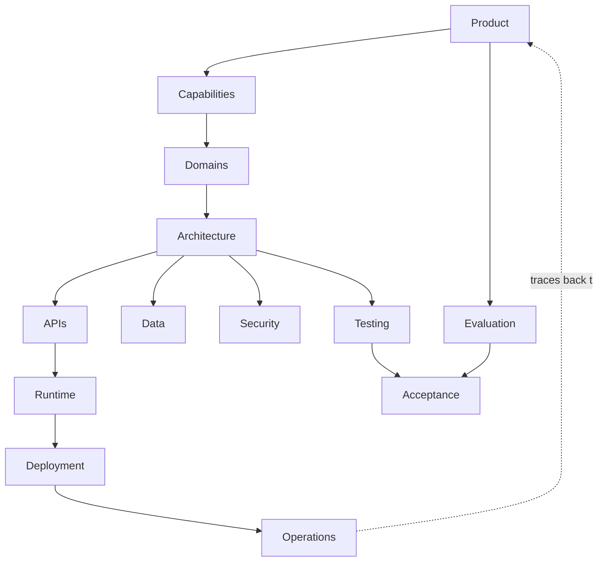

# Specification Relationships

Specifications relate to one another in a coherent conceptual chain: product intent flows into
capabilities, domains, architecture, and downward to operations, with each level constraining
and tracing to the next. These relationships are **conceptual**, not an implementation order —
they describe how specifications depend on and derive from one another, not the sequence in
which work is done. This is part of the
[Specification Framework](SPECIFICATION_FRAMEWORK.md).

## The relationship chain

| Level | Derives from | Constrains |
|-------|--------------|-----------|
| Product | — | Capabilities |
| Capabilities | Product | Domains |
| Domains | Capabilities | Architecture |
| Architecture | Domains | APIs, Runtime, Data, Security, … |
| APIs | Architecture | Integration, Runtime |
| Runtime | Architecture | Deployment |
| Deployment | Runtime, Operational | Operations |
| Testing | Functional, Architecture | Acceptance |
| Evaluation | Functional, Product | Acceptance |
| Operations | Deployment, Observability | — |

Each level **derives from** the level above (its intent constrains the level below) and
**traces to** it bidirectionally (see [Traceability](SPECIFICATION_TRACEABILITY.md)). A change
at one level propagates as a constraint downward and as a traceable dependency upward.

## Relationship rules

- **Derivation, not duplication.** A lower specification derives its constraints from a higher
  one; it never re-states or re-owns them.
- **Single ownership preserved.** Each specification is owned by one authority; relationships
  are references between owners.
- **Bidirectional.** Every derivation has a corresponding trace link back to its source.
- **Conceptual, not sequential.** The chain expresses dependency, not the order of work; a team
  may iterate across levels within the [lifecycle](SPECIFICATION_LIFECYCLE.md).

## Specification relationships (conceptual)

The chain is fully traceable in both directions; the dashed link closes the loop from
operations back to product intent, so any operational concern can be traced to the product
outcome it ultimately serves.
