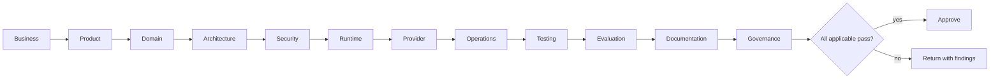

# Specification Review Framework

Every specification is reviewed along the dimensions below before it may be approved. Each dimension has a single owning [skill](../.claude/SKILL_CATALOG.md), a Handbook authority, and blocking conditions. This model specializes, for specifications, the [Execution Framework's Review Framework](../.claude/REVIEW_FRAMEWORK.md). Reviews find and record; they do not implement.

## Review dimensions

### Business review

- **Objective:** Confirm the specification serves a real business objective.
- **Owner:** Enterprise Architect
- **Inputs:** The specification; the business objective.
- **Outputs:** Business verdict and findings.
- **Acceptance criteria:** Traces to a business objective; value is clear.
- **Blocking condition:** A specification with no business objective is blocked.
- **Handbook authority:** [Chapter 01](../handbook/01-platform-vision/CHAPTER.md)

### Product review

- **Objective:** Confirm it serves the right personas, jobs, and outcomes.
- **Owner:** Product Architect
- **Inputs:** The specification; discovery findings.
- **Outputs:** Product verdict and findings.
- **Acceptance criteria:** Personas, jobs, and outcome criteria are present.
- **Blocking condition:** Missing outcomes or vanity scope is blocked.
- **Handbook authority:** [Chapter 02](../handbook/02-product-thinking/CHAPTER.md)

### Domain review

- **Objective:** Confirm it reflects the domain and its ubiquitous language.
- **Owner:** Domain Expert
- **Inputs:** The specification; the domain model.
- **Outputs:** Domain verdict and findings.
- **Acceptance criteria:** Bounded contexts and terminology are consistent.
- **Blocking condition:** Unbounded or ambiguous terminology is blocked.
- **Handbook authority:** [Chapter 05](../handbook/05-domain-driven-design/CHAPTER.md)

### Architecture review

- **Objective:** Confirm it fits the reference architecture and respects boundaries.
- **Owner:** Platform Architect
- **Inputs:** The specification; the architecture.
- **Outputs:** Architecture verdict and findings.
- **Acceptance criteria:** Boundaries and quality attributes are addressed.
- **Blocking condition:** Architectural contradiction or ownership breach is blocked.
- **Handbook authority:** [Chapter 06](../handbook/06-reference-architecture/CHAPTER.md)

### Security review

- **Objective:** Confirm it is secure by design against the trust model.
- **Owner:** Security Architect
- **Inputs:** The specification; the trust model.
- **Outputs:** Security verdict and required mitigations.
- **Acceptance criteria:** Threat-modeled; controls defined.
- **Blocking condition:** Any unresolved high-severity risk is blocked.
- **Handbook authority:** [Chapter 15](../handbook/15-security/CHAPTER.md)

### Runtime review

- **Objective:** Confirm runtime concerns are sound within runtime boundaries.
- **Owner:** Runtime Architect
- **Inputs:** The specification; runtime concerns.
- **Outputs:** Runtime verdict and findings.
- **Acceptance criteria:** Execution and state concerns are correct.
- **Blocking condition:** Execution or data leakage across planes is blocked.
- **Handbook authority:** [Chapter 07](../handbook/07-runtime-platform/CHAPTER.md)

### Provider review

- **Objective:** Confirm provider concerns preserve provider independence.
- **Owner:** AI Architect
- **Inputs:** The specification; provider concerns.
- **Outputs:** Provider verdict and findings.
- **Acceptance criteria:** Provider abstraction and neutrality preserved.
- **Blocking condition:** Vendor coupling is blocked.
- **Handbook authority:** [Chapter 09](../handbook/09-provider-platform/CHAPTER.md)

### Operations review

- **Objective:** Confirm it is operable and operationally ready.
- **Owner:** Observability Architect
- **Inputs:** The specification; operational concerns.
- **Outputs:** Operations verdict and readiness assessment.
- **Acceptance criteria:** Readiness criteria and signals defined.
- **Blocking condition:** Unobservable or unrecoverable design is blocked.
- **Handbook authority:** [Chapter 19](../handbook/19-devops/CHAPTER.md)

### Testing review

- **Objective:** Confirm software correctness is verifiable.
- **Owner:** Code Reviewer
- **Inputs:** The specification; acceptance criteria.
- **Outputs:** Testing verdict and coverage assessment.
- **Acceptance criteria:** Acceptance criteria are testable.
- **Blocking condition:** Untestable acceptance is blocked.
- **Handbook authority:** [Chapter 18](../handbook/18-testing/CHAPTER.md)

### Evaluation review

- **Objective:** Confirm AI quality is measurable, distinct from testing.
- **Owner:** AI Architect
- **Inputs:** The specification; quality criteria.
- **Outputs:** Evaluation verdict and metrics assessment.
- **Acceptance criteria:** AI quality criteria are measurable.
- **Blocking condition:** Immeasurable AI quality is blocked.
- **Handbook authority:** [Chapter 16](../handbook/16-evaluation/CHAPTER.md)

### Documentation review

- **Objective:** Confirm it is clear, consistent, and terminology-compliant.
- **Owner:** Technical Writer
- **Inputs:** The specification; the Writing Guide and Glossary.
- **Outputs:** Documentation verdict and corrections.
- **Acceptance criteria:** Clear, linked, and terminology-compliant.
- **Blocking condition:** Ambiguity or terminology drift is blocked.
- **Handbook authority:** [Chapter 21](../handbook/21-glossary/CHAPTER.md)

### Governance review

- **Objective:** Confirm ownership, authority, and change rules hold.
- **Owner:** Enterprise Architect
- **Inputs:** The specification; the governance model.
- **Outputs:** Governance verdict and findings.
- **Acceptance criteria:** Single ownership and authorities are correct.
- **Blocking condition:** Ownerless, co-owned, or unauthorized change is blocked.
- **Handbook authority:** [Chapter 11](../handbook/11-control-plane/CHAPTER.md)

## Review pipeline (conceptual)

A specification advances only when every applicable dimension passes.

## Extensibility

A new review dimension may be added when a new cross-cutting concern arises, provided it has a single owning skill, a Handbook authority, an acceptance criterion, and a blocking condition — preserving the one-owner, one-gate discipline.
