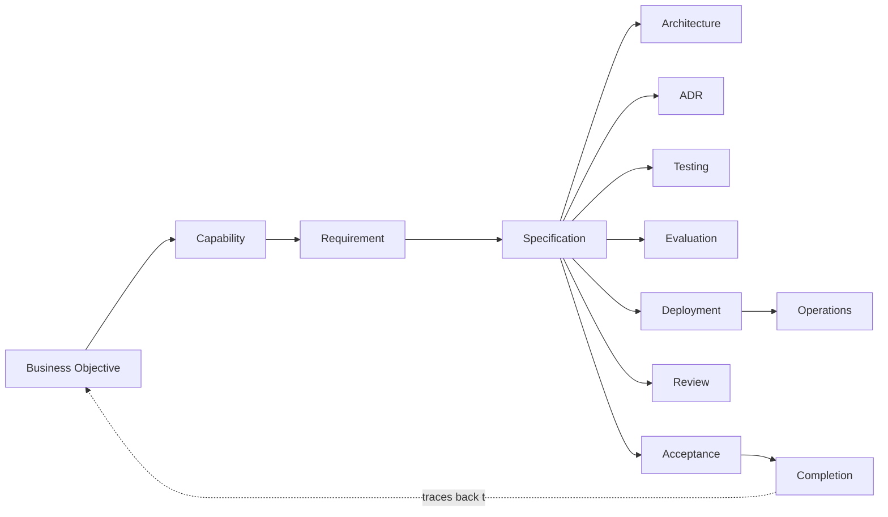

# Specification Traceability

Traceability makes every specification accountable to its origin and to what verifies it.
Complete, bidirectional traceability lets any specification be traced forward to what
satisfies and verifies it, and backward to why it exists. It is part of the
[Specification Framework](SPECIFICATION_FRAMEWORK.md).

## What every specification traces to

Each specification maintains explicit traceability links to:

| Trace target | Direction | Answers |
|--------------|-----------|---------|
| **Business objective** | upstream | Why does this exist? |
| **Capability** | upstream | Which capability does it serve? |
| **Requirement** | upstream | Which functional or non-functional requirement does it satisfy? |
| **Architecture** | lateral | Which architecture satisfies or constrains it? |
| **ADR** | lateral | Which significant decisions shape it? |
| **Testing** | downstream | How is its software correctness verified? |
| **Evaluation** | downstream | How is its AI quality measured? |
| **Deployment** | downstream | How is it deployed and made operable? |
| **Operations** | downstream | How is it operated in production? |
| **Review** | lateral | Which reviews assessed it? |
| **Acceptance** | downstream | Which acceptance criteria confirm it? |
| **Completion** | downstream | Which completion gates it passed. |

## Bidirectional traceability

Traceability is **bidirectional**: every forward link has a corresponding backward link.

- **Forward:** a business objective can be traced to the capabilities, specifications, tests,
  evaluations, deployments, and operations that realize it.
- **Backward:** any test, evaluation, or operational concern can be traced to the requirement,
  capability, and business objective it serves.

Bidirectional traceability makes two questions always answerable: *"What does this serve?"* and
*"What realizes this?"* — for any node in the chain.

## Traceability rules

- **Complete.** Every specification carries all applicable trace links; a missing applicable
  link is a traceability-gate failure.
- **Bidirectional.** Every link is navigable in both directions.
- **Single-owner-consistent.** Trace links reference owners; they never redefine what they
  reference (consistent with [Governance](SPECIFICATION_GOVERNANCE.md)).
- **Versioned.** Trace links point to specification versions; superseded links are retained for
  history.

## Traceability model (conceptual)

Every arrow above is navigable in both directions; the dashed link closes the loop from
completion back to the originating business objective, making the chain fully bidirectional.
