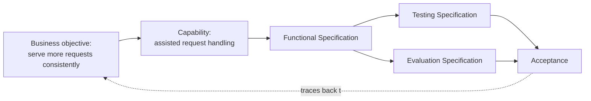

# Example — Traceability (conceptual)

A conceptual example showing bidirectional traceability. It illustrates methodology only and
names no technology.

Reading it forward answers "what realizes the objective?"; reading it backward answers "what
does this test serve?". Every link is navigable both ways.
