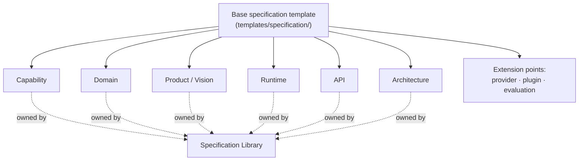

# Template Ownership & Consolidation

This document establishes the single owner of every template type in APEF, documents the full
base-and-extension inheritance the Foundation deferred (AD-0012, "the full inheritance is documented
in a later phase"), and records the consolidation decisions that remove template duplication. It is
the authoritative ownership map for templates and the entry document for the [`templates/`](README.md)
module (the frozen `README.md` remains the directory contract; this document carries the substance,
per the Module Entry Pattern). The consolidation is ratified as [ADR-0007](../adrs/decisions/0007-template-ownership-and-consolidation.md).

## The one-template-one-home principle

Every template type has exactly one **owning home** where its canonical form lives. Other locations
may register or point to it, but never hold a competing copy. This resolves the pre-EC-2 situation in
which the top-level `templates/` subdirectories were stubs while working forms had been delivered in
the Specification Library and (for ADRs) in the ADR framework.

## The base-and-extension model (AD-0012, completed)

- The **base specification template** is [`templates/specification/specification-template.md`](specification/specification-template.md).
  It defines the nine base sections every specification shares.
- A **specialized specification template** *extends* the base by refining the base's Section 4
  (Body) into the structure required for its category. It never removes a base section.
- The Specification Library's category templates are the delivered extensions:
  [`specifications/templates/`](../specifications/templates/) (product, capability, API,
  architecture, domain, runtime, plus reusable section fragments) and the per-area templates in
  `specifications/<area>/templates/`.

## Ownership map

| Template type | Owning home | Top-level `templates/` role |
|---------------|-------------|-----------------------------|
| ADR | [`adrs/ADR_TEMPLATE.md`](../adrs/ADR_TEMPLATE.md) (ADR framework) | `adr/` is a registry pointer; the canonical form is in the ADR framework. |
| Base specification | [`templates/specification/specification-template.md`](specification/specification-template.md) | **Owner.** The repository base template. |
| Capability, Domain, Product/Vision, Runtime, API, Architecture specifications | [`specifications/templates/`](../specifications/templates/) and the per-area `specifications/<area>/templates/` | `runtime/`, `api/`, `architecture/` are registry pointers to the Library extension. |
| Provider, Plugin, Evaluation specifications | The base template, extended on demand (extension points) | `provider/`, `plugin/`, `evaluation/` register the extension delta; no separate form is maintained until one is needed. |
| Epic, Feature, Story, Task (work items) | [`templates/`](README.md) (this module) | **Owner.** Forms delivered here; they feed [`specifications/backlog/`](../specifications/backlog/). |

## Consolidation decisions

1. **ADR template is owned by the ADR framework.** The canonical ADR form is
   [`adrs/ADR_TEMPLATE.md`](../adrs/ADR_TEMPLATE.md). The `templates/adr/` stub is superseded as a
   home; it is retained only as a registry entry pointing to the owner (its frozen README is
   unchanged). No ADR form is maintained in `templates/`.
2. **Specification templates are owned by the Specification Framework/Library.** The base lives in
   `templates/specification/`; every category extension lives in the Library. The top-level
   `runtime/`, `api/`, and `architecture/` stubs are redundant homes; they are registry pointers to
   the Library, not separate forms.
3. **Provider, plugin, and evaluation are recognized extension points**, authored from the base when
   needed, with their required Body delta named here rather than maintained as idle stub forms.
4. **Work-item templates (epic, feature, story, task) are owned top-level** and delivered as concrete
   forms, since they have no home elsewhere and are needed to plan SDD work.

## Extension deltas for the recognized extension points

Authored from the base template, refining Section 4 (Body):

- **Provider specification** — Body specifies: the provider capability surface, the abstraction
  contract it satisfies, substitutability guarantees, and lifecycle. Owned as an extension under the
  provider concern (Handbook Chapter 09).
- **Plugin specification** — Body specifies: the extension point targeted, the contract the plugin
  honors, isolation boundaries, and compatibility. Owned under the plugin concern (Chapter 10).
- **Evaluation specification** — Body specifies: what is evaluated, the evaluation criteria and
  method (evaluation, distinct from testing), datasets/inputs, and pass thresholds. Owned under the
  evaluation concern (Chapter 16).

## Result

Every template type now has one owning home; no two locations hold competing copies; the base and its
extensions are documented; and the top-level stubs are resolved as either owners (base, work items),
registry pointers (ADR, runtime, api, architecture), or recognized extension points (provider,
plugin, evaluation). This completes AD-0012 and closes the template-consolidation objective.

## Relationships

- Completes AD-0012 in the Foundation [Architecture Decisions](../bootstrap/ARCHITECTURE_DECISIONS.md).
- Ratified as [ADR-0007](../adrs/decisions/0007-template-ownership-and-consolidation.md).
- Aligns with the [Specification Framework](../specifications/SPECIFICATION_FRAMEWORK.md) and the
  [ADR framework](../adrs/ADR_FRAMEWORK.md).
